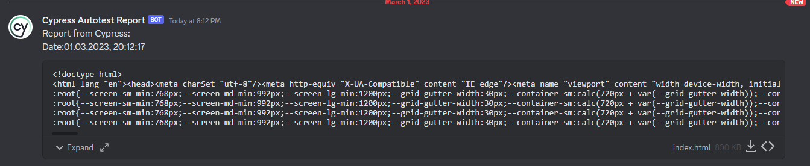
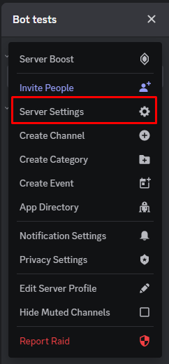
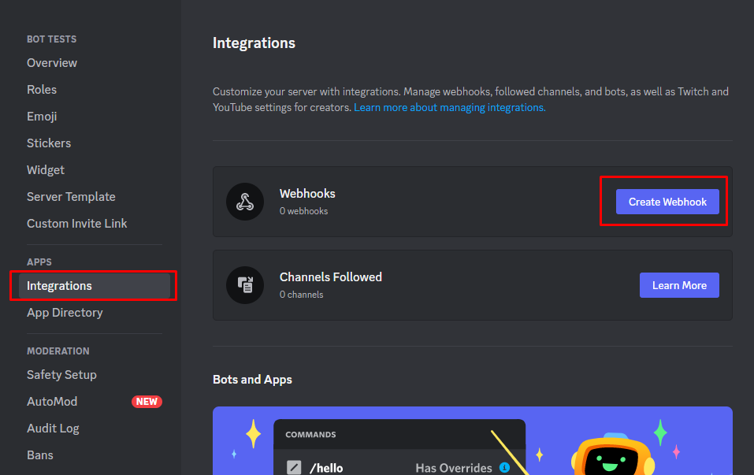
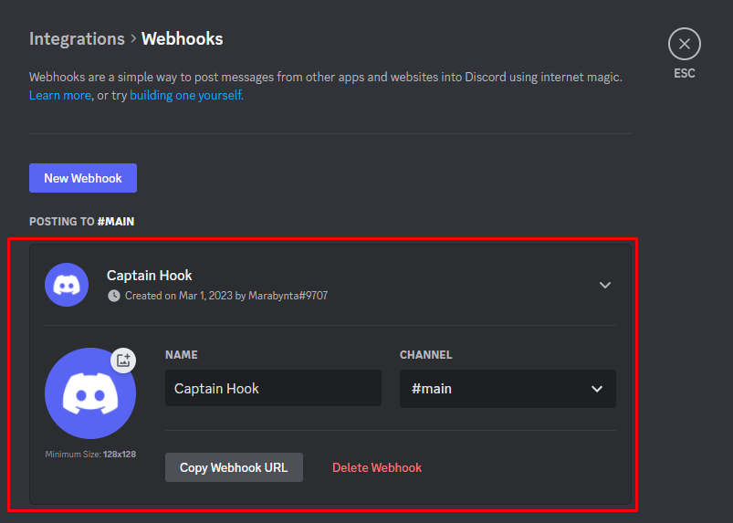
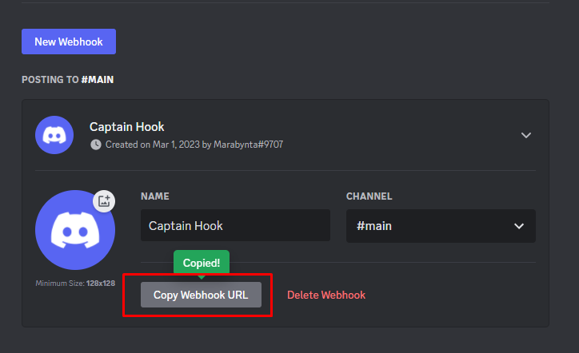
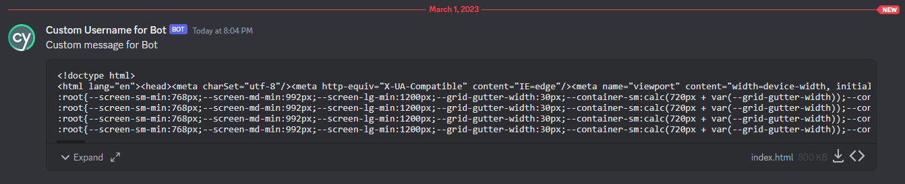

<h1>cypress-discord-webhook-integration</h1>

<a href="https://www.npmjs.com/package/cypress-discord-webhook-integration"></a> <a href="https://github.com/Smoliarick/cypress-discord-webhook-integration"></a>

This package helps to send reports for Cypress Autotests to Discord channel.

<h1>Content</h1>

- [Installation](#installation)
- [Function template](#function-template)
- [Default data in message for Discord](#default-data-in-message-for-discord)
- [Prepare your Discord Server for using package](#prepare-your-discord-server-for-using-package)
- [Add package into `cypress.config.js` file:](#add-package-into-cypressconfigjs-file)
- [Running code](#running-code)
- [Example](#example)


# Installation

```
npm i cypress-discord-webhook-integration
```

# Function template

```js
async function sendToDiscordWebhook(webhookUrl,
  files,
  content = undefined,
  username = undefined,
  avatarUrl = undefined,
);
```

# Default data in message for Discord

- `username` = `Cypress Autotest Report`
- `avatarUrl` = `https://avatars.githubusercontent.com/u/8908513?s=200&v=4`
- `content` = `Report from Cypress:\nDate: <now_date>`



# Prepare your Discord Server for using package

1. Open Server Settings in Discord Server



2. Open Integrations tab and click on the Create Webhook button



3. Click on your Webhook > Webhook is expanded



4. Setup your Webhook and click on the Copy Webhook URL button (this URL will be used for `.env` file)



# Add package into `cypress.config.js` file:

1. Create an `.env` file or add this param to existed file with environments:

```env
WEBHOOK_URL=https://discord.com/api/webhooks/id/token
```

2. Setup your reported for Cypress
3. Add this package to `cypress.config.js` file. Example:

```js
const { defineConfig } = require('cypress');

require('dotenv').config();

module.exports = defineConfig({
  e2e: {
    // other settings
    setupNodeEvents(on, config) {
      on('after:run', async (results) => {
        // on this step report should be generated
        // --------------------required part------------------------------
        const sendToDiscordWebhook = require('cypress-discord-webhook-integration'); // import lib
        const webhookURL = process.env.WEBHOOK_URL; // REQUIRED: Webhook URL for Discord
        const files = ['./cypress/reports/html/index.html']; // REQUIRED: File paths
        // --------------------required part------------------------------

        // --------------------custom data------------------------------
        const customUsername = 'Custom Username for Bot'; // Custom name for Bot's username in Discord
        const customMessage = 'Custom message for Bot'; // Custom message for Bot's message in Discord
        const customAvatar = 'https://cdn.sanity.io/images/o0o2tn5x/production/13b9c8412093e2f0cdb5495e1f59144967fa1664-512x512.jpg'; // Custom avatar URL for Bot in Discord
        // --------------------custom data------------------------------

        // --------------------required part------------------------------
        // Using function
        await sendToDiscordWebhook(
          webhookURL,     // required variable
          files,          // required variable
          // customMessage,  // uncomment it if you use custom value
          // customUsername, // uncomment it if you use custom value
          // customAvatar,   // uncomment it if you use custom value
        );
        // --------------------required part------------------------------
      });
      return config;
    },
    specPattern: 'cypress/e2e/**/*.spec.{js, jsx, ts, tsx}',
  },
});

```

# Running code

1. Run Cypress tests: `npx cypress run`
2. After it you should see message in Discord channel which you selected in Webhook



3. You can upload report from Discord channel when you want.

Video example:


https://user-images.githubusercontent.com/104084410/222214637-f130fda1-fcf3-4dab-83f7-a53a087fbbf5.mp4


# Example

You can use this example: https://github.com/Smoliarick/cypress-discord-webhook-integration-example. This project was set up using cypress-discord-webhook-integration package.